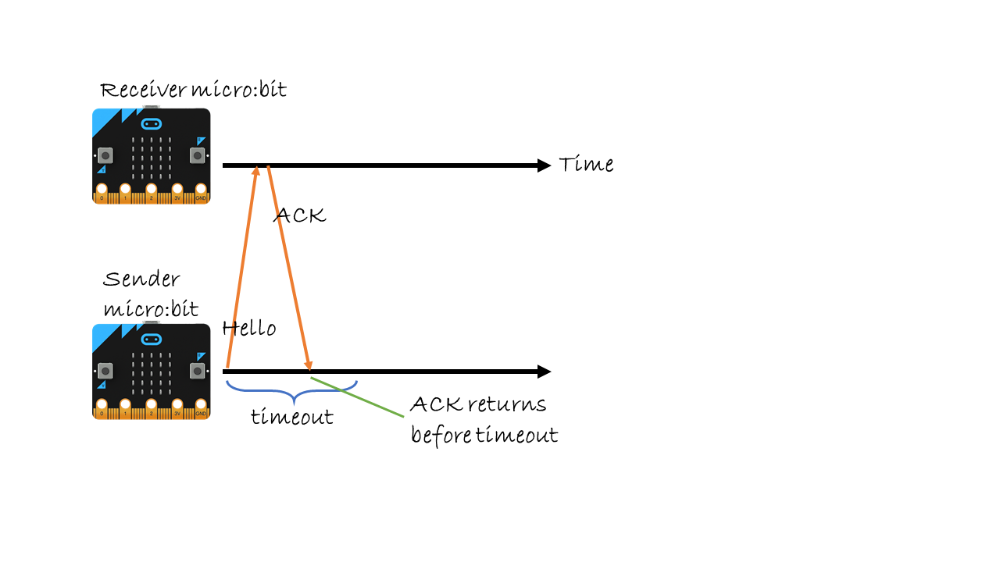
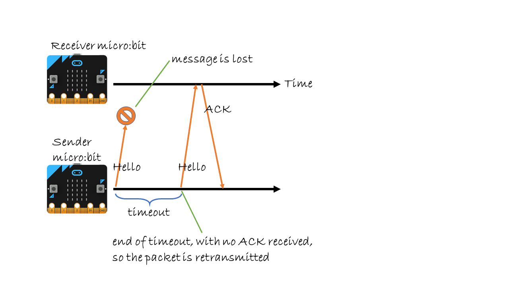
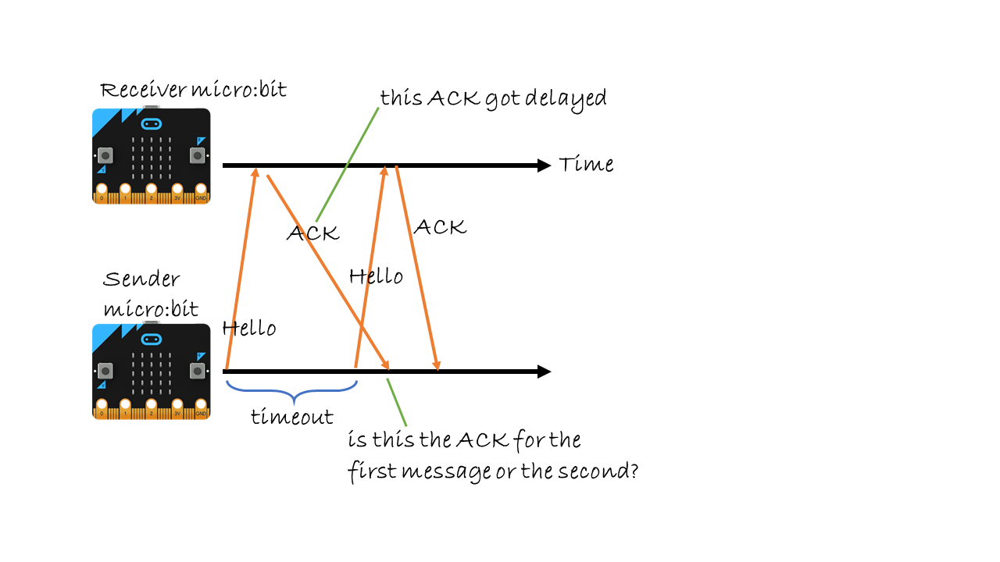

Handling Errors: Acknowledgements
=================================

Introduction
------------

In the previous chapter, you used retransmissions to deal with transmission errors. In this chapter, you will improve on this by using acknowledgements. Doing this activity, you will learn
several key methods and protocols for error control in networking.

In summary, you will learn:

- The concept of *acknowledgements*

- The concept of *Automatic Repeat Request (ARQ)*

- The *Stop-and-Wait protocol*

### What you’ll need

    2 micro:bits
    1 teammate

Background
----------

In the previous chapter, a message was transmitted multiple times no
matter if the receiver already received an earlier copy. This is
wasteful! You could have been transmitting new information instead of
repeating yourself. This is also wasteful for the receiver, which needs to
keep discarding the duplicates.

To avoid this, we will introduce a new concept called
*acknowledgements*.

!!! hint "Definition 1: _Acknowledgement (ACK)_"
	Acknowledgements are small messages that the receiver sends back, to tell the sender it received a message. The sender then knows it doesn't need to retransmit, and is ready to send the next message. 
	
If the sender does not receive an acknowledgment, only then it should retransmit its message.

But how long should the sender wait an acknowledgement? This is
determined by a *timeout*.

!!! hint "Definition 2: _Timeout_"
	A timeout is the amount of time allowed to pass
	before the sender gives up waiting for an acknowledgement.

In other words, if the sender does not receive an acknowledgement within
a timeout period, it will decide the packet must have got lost.

Acknowledgements are used in an error control method called *Automatic
Repeat Request (ARQ)*.

!!! hint "Definition 3: _Automatic Repeat Request (ARQ)_"
	Automatic Repeat Request is an error
	control method. It uses acknowledgements and timeouts to retransmit
	packets. Retransmissions may continue until the sender receives an
	acknowledgment, or a maximum number is reached.

ARQ is used both in the Internet and mobile networks.

In its simplest form, an Automatic Repeat Request uses the
*Stop-and-Wait ARQ protocol*

!!! hint "Definition 4: _Stop-and-Wait ARQ Protocol_"
	In the *Stop-and-Wait ARQ protocol*, the sender:

	1. sends a packet
	2. waits for the acknowledgement (ACK) or but gives up after a timeout period
	3. if timeout, goes to step 1
	4. if ACK, gets a new packet, goes to step 1.

In Stop-and-Wait protocol, the sender cannot send a new packet until it
receives the acknowledgement for the previous one.

The figure below shows an example of a successful retransmission. The sender sends "Hello" and the receiver responds with an ACK. The sender received the ACK before the timeout ends, so it knows the packet was received OK. Now, the sender can start sending another message.

!!! note ""
	**Figure 1:** Stop-and-Wait ARQ protocol: The receiver sends and ACK back 
	to the sender, so the sender knows that the "Hello" message arrived OK.

Now let's look at some error cases. Figure below shows that the first message from the sender is lost. So, the receiver does not send an ACK. When the timeout ends, the sender has not received an ACK. So, it retransmits the message. The second attempt is successful, and the sender receives an ACK on time (before a timeout).

!!! note ""
	**Figure 2:** Stop-and-Wait ARQ protocol: The message gets lost, so the sender retransmits it.

The figure below shows an example where the message from the sender is received, but the ACK from the receiver is lost. Again, when the timout ends, the sender has not received an ACK. So, it retransmits its message. The receiver receives the duplicate message, and again, sends an ACK. This time the ACK succeeds and things can go as normal.

!!! note ""
	**Figure 3:** Stop-and-Wait ARQ protocol: The message was received, but the 
	ACK gets lost, so the sender retransmits the message.
	
These examples show that Stop-and-Wait ARQ handles data packet and ACK losses quite well. But,
does it always work? Figure below shows a
problem that can hapen when messages or ACKs are delayed. In other words,  timeouts end before ACKs can be received. In this example, when the sender sends the first "Hello", the receiver receives this message and send an ACK back. But the sender times out before it receives this ACK. So, it retransmits the second "Hello". Then, it receives the delayed ACK message. But what packet this ACK refer to? The first "Hello", or the second? This confuses the receiver as well! Is the second "Hello" a new packet, or a duplicate?

!!! note ""
	**Figure 4:** Stop-and-Wait ARQ protocol: What happens if a message gets 
	delayed? It's not clear which ACK refers to which message.

 To solve this confusion, the protocol needs to use sequence numbers.

!!! hint "Definition 5: _Sequence number_"
	A sequence number is a number chosen by the sender, and included in the packet header. When the
	receiver sends an ACK, it includes the next sequence number to tell the sender that it received the previous packet, and is ready for the next one.

For example, when the sender sends “Hello, 0”, this is a “Hello” message
with a sequence number 0. On receiving this packet, the receiver will
send “ACK, 1”, which says “I received packet 0, send me packet 1 next”.
We won't use sequence numbers in this lesson's tasks, but you could try adding them as an extended activity.

Programming: Stop and Wait!
---------------------------

To program the Stop-and-Wait ARQ protocol, you will work with a
teammate. Like in [Handling Errors: Retransmisions](../retransmissions/retransmissions.md), you will use the
custom *ErrorRadio* blocks to send messages with errors. The
communication is unicast, so you will still use source and destination
addresses in your messages. like you did in the
[Unicast communication: One to One](../unicast/unicast.md). Do not forget that your receivers need
to check if the received messages are addressed to them!

### Task 1: Design your data and ACK packets

**Description:** Before you can send and receive any packets, first you
will decide what your data and ACK packets should look like.

**Instruction:** Discuss what is the minimum information you should have
in your packets. Create two string variables for data and ACK packets, using the Text blocks in the JavaScript Blocks editor.

### Task 2: Timeout and retransmission 

**Description:** To program the Stop-and-Wait, you need a timeout
mechanism. After each transmission, you need to wait for the
ACK or time out. The main decision you need to make is
how long the timeout should be.

**Instruction:** To do this task, you may either start from scratch or
change your code from [Handling Errors: Retransmisions](../retransmissions/retransmissions.md) for the
sender micro:bit. At the sender side, program how to wait for th ACK. In the *Basic* menu, the *pause* function will
be useful for the timeout mechanism. If your pause ends before you
receive an acknowledgement, then you will retransmit the packet. If you
receive the ACK before the pause ends, you will remember this information
when the pause ends and will use it to send your next message.

To test the program, you need to also program the receiver. The receiver
sends the ACK packet for each data packet it receives.

### Task 3: Testing the reliability of Stop-and-Wait

**Description:** In this task, you will experiment with the
Stop-and-Wait protocol you programmed. For this, you will add a counter
on the sender side to count the number of retransmissions. On the
receiver side, you need a counter to understand the effect
acknowledgements on retransmissions.

**Instruction:** Decide on a timeout/pause time. Send five numbers to your teammate’s
micro:bit using the Stop-and-Wait protocol. You will run the protocol
for a fixed error value (25 and 75), repeating each experiment three
times.

In the table below, retransmissions are the number of times a packet needed to
be resent. Duplicates are the number of times the receiver received
unnecessary retransmissions. So, let’s assume, at the end, the sender
sent the following:

       1 1 1 2 2 3 4 4 4 4 5 5

There were 7
retransmissions. And the receiver received the following:

       1 2 2 3 4 5 5

Two duplicates were received. The first row of the table is filled as an example. Use your experiment results to fill in the rest. By comparing retransmissions to duplicates, discuss how good the
protocol is in handling errors.

| **Error value** | **Experiment no.** | **Retransmissions** | **Duplicates** |
|-----------------|:-------------------|:--------------------|:---------------|
| 25 | (example) | 7 | 2|
| 25 | 1 | | |
| 25 | 2 | | |
| 25 | 3 | | |
| 75 | 1 | | |
| 75 | 2 | | |
| 75 | 3 | | |

Extended activity
-----------------

!!! attention "Exercise 1"
	Discuss how acknowledgements work better than using only
	retransmissions. Do you see any problems with using acknowledgements?

!!! attention "Exercise 2"
	Discuss how the duration of the timeout period affects your protocol. 
	For instance, what happens if your timer is too short or too long? 
	What happens if acknowledgements are delayed. 

!!! attention "Exercise 3"
	Research the "Alternating Bit Protocol", which uses a 1-bit sequence number 
	to help with the problems discussed in the figures.

Problems
--------

1. What does ARQ mean?

2. In the Stop-and-Wait ARQ protocol, if 10 packets are sent, how many acknowledgements are needed?

Resources
---------

Video: The Internet: Packet, Routing and Reliability -
    <https://youtu.be/AYdF7b3nMto>
