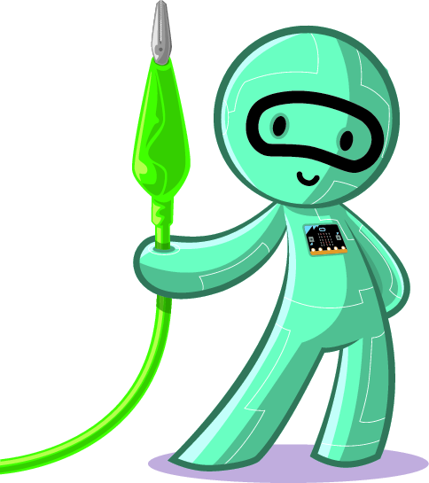

Communication over Wires
========================



Introduction
------------

Everything is connected nowadays! Computers and devices connect to each other to form networks. And these networks connect to
form the Internet. When we say *computers* or *devices*, these
can be anything from a traditional laptop to a cellphone, to a washing machine, to a humidity sensor. Of course, it can also be
your micro:bit. More and more, the Internet is becoming an *Internet of Things*.

In this chapter, you will form your own network using wires to
connect two micro:bits. Doing this, you will learn:

- the concept of a *communications medium*, and *signals*

- the concept of *binary* and *bit*

- the concept of a *network*

### What you’ll need?

    2 micro:bits
    4 crocodile clip leads
    1 battery holder, and 2 AAA batteries
    1 teammate

Background
----------

For two micro:bits to be able to send messages to each other, they
somehow need to be connected, whether by wires or wirelessly - we call this
a *communications medium*.

A message could be a
string like “Hello”, a number like “9”, or an icon image. The
micro:bits convert each message to a signal to send it over the
*communications medium*.

!!! hint "Definition 1: _Communications medium_"
	A communication medium is the physical path over which a signal is transmitted.

!!! hint "Definition 2: _Signal_"
	Signals are the electromagnetic voltages or waves transmitted
	on a physical wired or wireless medium.

For example, take the case when we say “Hello” into a landline
telephone. The telephone handset converts the sounds into an
electrical voltage signal. Then, this signal is transmitted to the
receiving telephone by wires; and at the receiver, it is converted back
into sound.

!!! attention "Exercise 1"
	What is the wireless physical medium that makes radio communication
	possible?

Computers, and also your micro:bit, cannot process signals without
converting them to binary data: 0s and 1s. Also, the binary data
processed by computers need to be converted into signals before they can
travel a communication medium.

!!! hint "Definition 3: _Bit_"
	A bit is the smallest unit of data in a computer. It is like an
	atom. A bit can be either a 1 or a 0.

A group of 8 bits is a *byte*. Table \[tab:bit\] shows other example
groupings.

|**Name** | **Size**|
|---------|:--------|
|Byte (B) | 8 bits |
|Kilobyte (KB) | 1024 bytes |
|Megabyte (MB) | 1024 kilobytes |
| Gigabyte (GB) | 1024 megabytes |
| Terabyte (TB) | 1024 gigabytes |

By connecting computers or any device through different communications
mediums, we create networks.

!!! hint "Definition 4: _Network_"
	A computer network is a collection of computers or devices,
	which are connected to communicate with each other. In a computer
	network, there is at least two computers. Two or more networks can
	connect to form a larger network: a network of networks. Internet is a
	massive network of networks!

In this chapter, you will create a network of two micro:bits, connected
via wires.

Programming: A Simple Heart Transfer
------------------------------------

In this section, you will connect two micro:bits via wires.
You will send a *Heart* icon from one micro:bit to another.
The figure below shows how a heart icon should look like on the
micro:bit display [^1].


!!! note ""
	**Figure 1.1:** Micro:bit displaying a heart icon

This activity is best done with a teammate. In the following, you will go
through four tasks to program your micro:bits.

### Task 1: Watch the “Simple Heart Transfer”

**Description:** We have created a video to show how your connections
and program should work in this activity.
See the video at [Simple Heart Transfer](https://microbit.nominetresearch.uk/networking-book/simple_heart_transfer.html).

**Instruction:** Watch the Simple Heart Transfer in the video.

**Important: Do not skip this
task. It will help you to test whether the files you downloaded for Task 2
work. It will also help you to write your program for this chapter.**

### Task 2: Connect your micro:bits and test telegraph

**Description:** You will connect your micro:bits using wires, and use
a program to check the connections. You can follow the instructions below, or
there is a more detailed step-by-step instructions in the *Micro-bit telegraph activity*[^2] on the micro:bit website.

**Instruction:**  Using crocodile clips, connect the 3V pin between the
two micro:bits, and connect the GND pins. Then connect pin 1 on one
micro:bit to pin 2, and vice-versa.  Be careful to get the crocodile clip connections right: two of
the wires connect straight (3V-to-3V and
GND-to-GND) but the other two cross over (1-to-2
and 2-to-1).

See the figure showing connections for an example, and look at the colours
carefully (you don’t need to use the same colours of course, but they
must make the same connections).


!!! note ""
	**Figure 1.2:** Wiring micro:bits. Two of the wires connect straight
	(3V-to-3V and GND-to-GND) but the other two cross over (1-to-2 and 2-to-1)


To test, use the program from the figure showing the Telegraph program; press button A
on each micro:bit and check that the LED illuminates on the other one. You will use the blocks from the
*Pins* menu. This menu is under *Advanced*. Click on the *More* link to
see all the options.

```blocks
let signal = 0
input.onButtonPressed(Button.A, function () {
    pins.digitalWritePin(DigitalPin.P1, 1)
    basic.pause(100)
    pins.digitalWritePin(DigitalPin.P1, 0)
})
basic.forever(function () {
    signal = pins.digitalReadPin(DigitalPin.P2)
    if (signal == 1) {
        led.plot(2, 2)
    } else {
        led.unplot(2, 2)
    }
})
```

!!! note ""
	**Figure 1.3:** Telegraph program. Pressing button A sends a signal to the 
	other side using Pin 1. The receiver micro:bit listens on Pin 2 to check 
	if a signal is received. If there is a signal, it lights up the (2,2) pixel 
	on the display.

### Task 3: Test “Simple Heart Transfer” Hex files

**Description:** We provided two files, named [microbit1\_wired\_simpleheart\_secret.hex](microbit1_wired_simpleheart_secret.hex) and
[microbit2\_wired\_simpleheart\_secret.hex](microbit2_wired_simpleheart_secret.hex) in this folder,
for you to test how the final program should work. These files will run
on your micro:bits, but you will not be able to display the code using
the JavaScript Blocks editor.

**Instruction:** Download the *Simple Heart Transfer* code into your
micro:bits. There are two different hex files for micro:bit 1 and
micro:bit 2. Test the program by tilting your micro:bits and checking
when the heart icon is displayed.

### Task 4: Program a heart transfer

**Description:** In this task, you will program your micro:bits to get a
similar behaviour to what you observed in the Tasks 2 and 3. To do this
task, you will need to think about the following questions:

1. Which input will the micro:bits react to in your program?

2. How do the microbits send data to each other?

3. **Hint: Do you think they are sending each other an actual Heart
    icon?**

**Instruction:** For question 1, look at the options under the JavaScript Blocks editor  *Input*
menu. For question 2, use the example Telegraph program above. For question 3, here is another big hint.
**Hint: Assume micro:bit 2 knows that it will be receiving a Heart icon
from micro:bit 1.**

Program your micro:bit 1 so that:

1. It displays a heart icon until it is tilted over micro:bit 2.

2. When tilted over micro:bit 2, it sends a pulse to micro:bit 2 over
    the correct pin.

3. When micro:bit 1 receives a pulse on its correct pin, it displays a
    heart icon .

Program your micro:bit 2 so that:

1. It displays a heart icon when it receives a pulse on its
    correct pin.

2. When tilted over micro:bit 1, it sends a pulse to micro:bit 2 over
    the correct pin.

Extended activity
-----------------

!!! attention "Exercise 2"
	Watch the [Wired\_pixel\_by\_pixel\_heart.m4v](https://microbit.nominetresearch.uk/networking-book/pixel_heart_transfer.html). Based on this video, discuss with your teammate how you can send more complex data across wires. Make a proposal and discuss with others.

!!! attention "Exercise 3"
	Watch the two videos under the Resources section. How are they related to your activity? Discuss.

Problems
--------

1. What is a bit?

2. How many bits are there in a kilobyte?

3. Explain the use of Ground (GND) and 3V pins in your micro:bit.

4. How many bits did you send to the receiver in your “Simple Heart Transfer” program?

5. How are the bits in your program sent over the wire in your program?

Resources
---------

- Video: What is the Internet (Code.org) -   <https://youtu.be/Dxcc6ycZ73M>

- Video: The Internet: Wires, Cables and Wifi (Code.org) - <https://youtu.be/ZhEf7e4kopM>

- BBC Bitesize, Introducing Binary - <http://www.bbc.co.uk/education/guides/zwsbwmn/revision>

[^1]: This image is by micro:bit Educational Foundation at [www.microbit.org](https://www.microbit.org).

[^2]: Microbit telegraph activity <https://makecode.microbit.org/projects/telegraph/make>  
